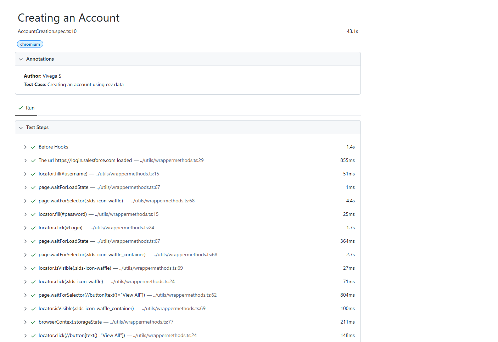
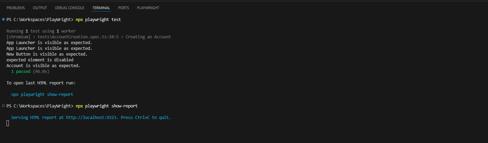

# Salesforce Application - PlayWright TypeScript Project
This project uses **Playwright** for automated browser testing and end-to-end testing of web applications. Playwright is a Node.js library that allows for testing of web pages in modern browsers like Chromium, Firefox, and WebKit.

## Page Object Model Framework

## 📂 Folder Structure :
constants/ - Global constants (URLs, credentials)
customFixtures/ – Custom Playwright test fixtures
data/ – JSON-based test data (users, tokens)
pages/ – POM structure for UI tests
tests/ – Actual test specs (e.g., Account creation tests)

## ✨ Key Features
✅ Playwright with TypeScript support
✅ Modular Page Object Model (POM)
✅ API & UI automation
✅ JSON data-driven testing
✅ Custom Playwright fixtures
✅ Helper utilities for common actions
✅ GitHub Actions CI/CD ready
✅ Logging & custom reporter setup

## 📝 Future Enhancements (Suggestions)
    Add Allure or HTML Reporter.
    
    
    